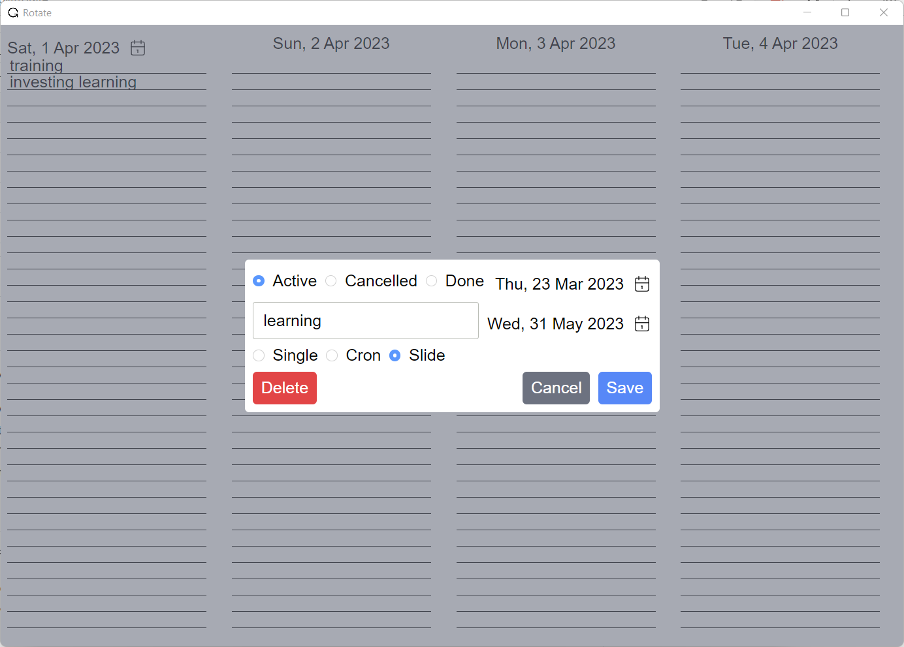

# Rotate

Rotate is a weekly todo application that allows you to create and manage tasks. You can create three types of tasks:

1. Simple Task: A task with a fixed date that needs to be completed by that date.
2. Slice Task: A task that needs to be completed daily and will be moved to the next day if it hasn't been completed on the current day.
3. Cron Task: A task that needs to be completed regularly based on a cron expression.

## Installation

To install Rotate, follow these steps:

- Download the latest release from the Releases section of the repository.
- Unzip the downloaded file.
- Double-click on the executable file to start the application.

All releases are done automatically via GitHub actions so you are downloading the app built from the source code that you can always check.

That's it! The application should now be up and running on your desktop.

## Usage

To use Rotate, follow these steps:

- Open the application.
- Select a start date for the week at the top left corner.
- Click on any empty slot in the calendar to create a new task.
- Choose the task type (Simple, Slice, or Cron) and provide the necessary details such as due date and cron expression if applicable.
- Click on the "Save" button to save the task.
- To view your tasks, simply select a start date at the top left corner. All tasks for that week will be displayed in the calendar.
- To mark a task as completed, simply double-click on the task and mark as 'Done'.
- To edit a task, double-click on the task and change required properties.
- To delete a task, double-click on the task and click on "Delete" button.

That's it! You can now use Rotate to manage your tasks for the week.

## Contributing

If you would like to contribute to Rotate, please follow these steps:

- Fork the repository: https://github.com/ypyl/rotate.git
- Create a new branch: git checkout -b feature/my-new-feature
- Make your changes and commit them: git commit -am 'Add some feature'
- Push to the branch: git push origin feature/my-new-feature
- Create a new pull request.

## License

Rotate is licensed under the MIT License. See LICENSE for more information.

*This README file was generated by ChatGPT, a large language model trained by OpenAI, based on the GPT-3.5 architecture.*
